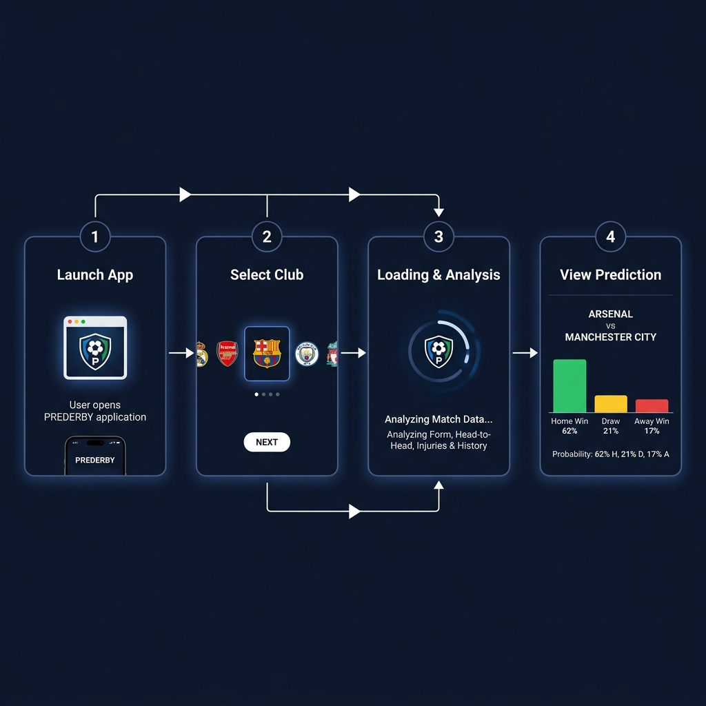
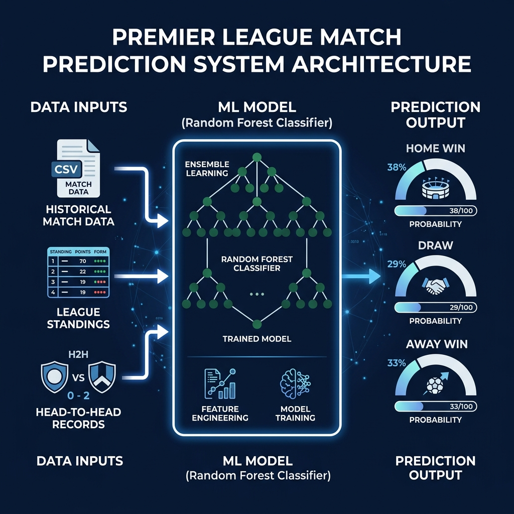
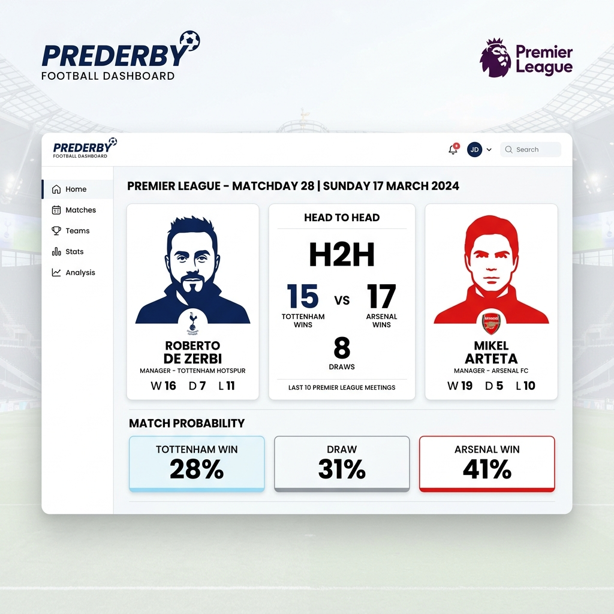

<div align="center">

# ⚽ PREDERBY
### Premier League Big Six Derby Prediction System


*A machine learning–powered prediction engine for the Premier League's most contested derbies.*

</div>

---

## 📖 What Is PREDERBY?

PREDERBY is a predictive analytics desktop application built in Python that forecasts the outcomes of **Big Six Premier League derbies**. It covers: **Arsenal, Chelsea, Liverpool, Manchester City, Manchester United, and Tottenham Hotspur**.

Built for ICT 206 (Intelligent Systems), the application combines real historical match data with a trained **Random Forest Classifier** to produce intuitive match predictions, complete with:

- Head-to-head records
- Probability breakdowns (Home Win / Draw / Away Win)
- Manager tactical insights
- Club stats and league standing

---

## 🎬 User Flow

This is how a typical session through the app works:



1. **Launch App** → Run `python src/main.py` or open `PREDERBY.exe`
2. **Select Club** → Swipe through the Big Six carousel to pick your team
3. **Load & Analyse** → The app loads your team and finds its next major derby
4. **View Prediction** → The ML model outputs a full match prediction with probabilities and analysis

---

## 🧠 Machine Learning Architecture

The prediction engine is powered by a supervised classification model trained on historical Premier League data:



| Component | Detail |
|---|---|
| **Algorithm** | Random Forest Classifier (Scikit-learn) |
| **Training Data** | Historical Big Six match records (`data/final_matches.csv`) |
| **Fixture Data** | 2025/26 real fixture list (`data/2025_26_real_fixtures.csv`) |
| **Output** | Probabilities: `home_win`, `draw`, `away_win` |

The model is pre-trained and saved as `models/predarby_model.pkl`. A `train_model.py` script is included so you can retrain it on updated data.

---

## 📊 Results Dashboard

Once a prediction is made, the app displays a full match analysis panel:



The results screen shows:
- **Manager Cards** — Portrait cards for both managers with their club badge
- **Head-to-Head Stats** — Historical win counts between the two sides
- **Probability Boxes** — Three clearly labelled probability outcomes
- **Model Highlights** — Simple, readable explanation of the model's reasoning
- **Deep Analysis** — Tactical and form-based technical breakdown

---

## ✨ Key Features

| Feature | Description |
|---|---|
| 🎠 **Club Carousel** | Browse all Big Six clubs with swipe navigation |
| 📈 **Live-style Stats** | Up-to-date league position, form, goals, and record |
| 🤝 **Head-to-Head** | Full historical encounter breakdown |
| 🤖 **ML Prediction** | Real-time probability output from trained model |
| 🧑‍💼 **Manager Analysis** | Photo cards + tactical profiles for both managers |
| 🧪 **Dual Analysis Mode** | Both "Simple" (layperson) and "Technical" insights |

---

## 🚀 Getting Started

### Prerequisites

- Python **3.8+**
- pip

### Method 1: Run the Executable (Windows Only — No Python Required)

1. Navigate to `dist/`
2. Double-click `PREDERBY.exe`
3. Your default browser will open at `http://localhost:8081`

### Method 2: Run from Source

```bash
# 1. Clone the repository
git clone https://github.com/Muaaz2007/PREDERBY.git
cd PREDERBY/Source_Code

# 2. Install dependencies
pip install -r requirements.txt

# 3. Run the application
python src/main.py
```

Then open `http://localhost:8081` in your browser.

---

## 📂 Project Structure

```
Source_Code/
├── src/
│   ├── main.py          # Main UI application (NiceGUI)
│   ├── config.py        # Team data, managers, standings, colors
│   ├── predictor.py     # ML prediction logic
│   ├── train_model.py   # Script to retrain the model
│   └── assets/          # Kit images, manager photos, logos
│       └── managers/    # Manager portrait photos
├── data/
│   ├── final_matches.csv           # Historical match training data
│   └── 2025_26_real_fixtures.csv  # Current season fixture list
├── models/
│   └── predarby_model.pkl  # Pre-trained Random Forest model
├── requirements.txt
├── LICENSE
└── README.md
```

---

## 🛠️ Built With

- [NiceGUI](https://nicegui.io/) — Python web UI framework
- [Scikit-learn](https://scikit-learn.org/) — Machine learning model
- [Pandas](https://pandas.pydata.org/) — Data processing
- [NumPy](https://numpy.org/) — Numerical operations
- [PyInstaller](https://pyinstaller.org/) — Executable packaging

---

## 📜 License

Distributed under the MIT License. See [LICENSE](LICENSE) for more information.

---

<div align="center">

*Developed by **Muaaz Ahmed Syed** · ICT 206 — Intelligent Systems Assignment*

</div>
